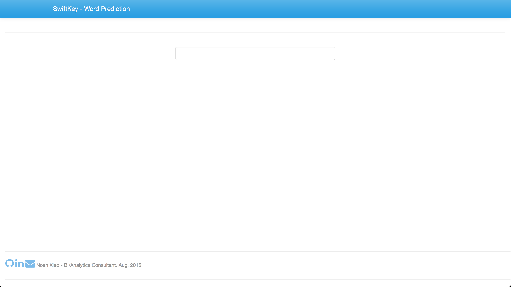
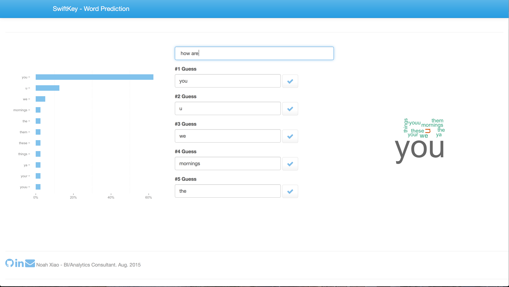

SwiftKey - Word Prediction
========================================================
author: Noah Xiao
date: 14 Aug 2015
font-family: 'Helvetica'
autosize: true
css: style.css

Intro
========================================================

<small><small>This presentation acts as part of the completion requirement of the Coursera John Hopkins Data Science Specialisation Capstone.  </small></small>

<small><small>The capstone project is about building a word prediction app with R. The app takes the input of word(s)/sentences, and generates a list of predictions of the next word as output.  </small></small>

<small><small>The presentation is separeted as the following sections:</small></small>  
- <small><small>A general introduction to the app.  </small></small>
- <small><small>A detailed intrusction and function of the app.  </small></small>
- <small><small>A description of the algorithm behind the app.  </small></small>

The App
========================================================

<small><small>When first loading the app, a very simple page is shown as above.</small></small>
***

<small><small>After typing something in the text box, word predictions and visualisation are shown as above.</small></small>

Instructions and Functions of the App
========================================================

The app is built on top of Shiny, a web application framework for R. 

* <small><small>When first loading the page, nothing except the text input box is shown. The user just need to type the word(s)/sentence he/she wants to predict from.  </small></small>
* <small><small>Then, 3 sections will show up:</small></small>
 * <small><small>A prediction ranking graph: Up to 15 predictions are sorted by probability.</small></small>
 * <small><small>A prediction list: Up to 5 top ranked predictions are shown. Once the user pressed the tick button, the corresponding prediction will be attached to the text input box at the top.</small></small>
 * <small><small>A wordcloud: Up to 15 predictions are shown in a format of word cloud (same colour indictes same probability)  </small></small>
* <small><small>Changing the text input will be reflected immediately in the prediction details.  </small></small>

The Algorithm
========================================================

<small><small>1. Data Preprocessing (Cleaning the training data)</small></small>
- <small><small>Decoding and Translation.  </small></small>
- <small><small>Removal of numbser, punctuations, redundant spaces, and lowercase the files.  </small></small>
- <small><small>N-gramming (1 / 2 / 3 / 4 grams) and bulid a probability table for each gram.  </small></small>

<small><small>2. Modelling and Predicting (Applying a simple model)</small></small>
- <small><small>Search from a higher gram table, if found, then sort the predictions by probability, if not, go to a lower gram table, until reaching the uni-gram (Simple back-off model).  </small></small>
- <small><small>Build a Kneser-Ney model, considering all the uni-gram words by combining the proability in each gram level.  </small></small>
- <small><small>Having compared the results from above two, the accuracy is similar but the simple back-off has a much much better runtime performance.  </small></small>
<small><small>Therefore, the simple back-off is being applied.  </small></small>
